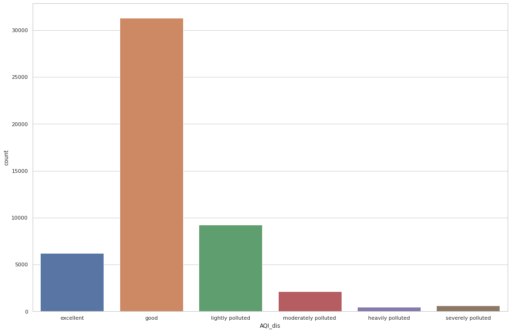
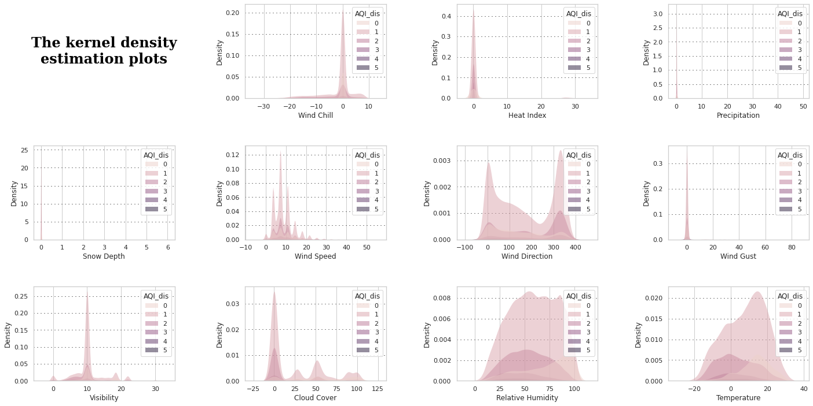
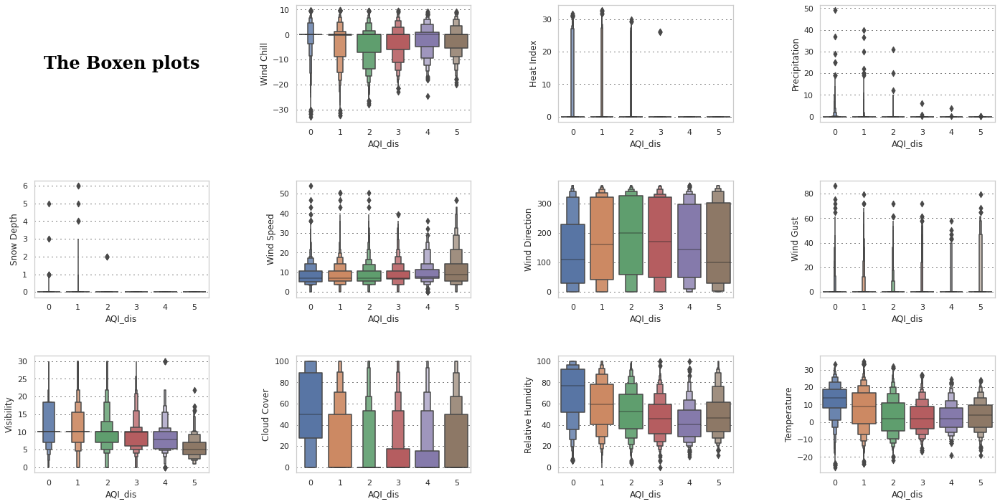
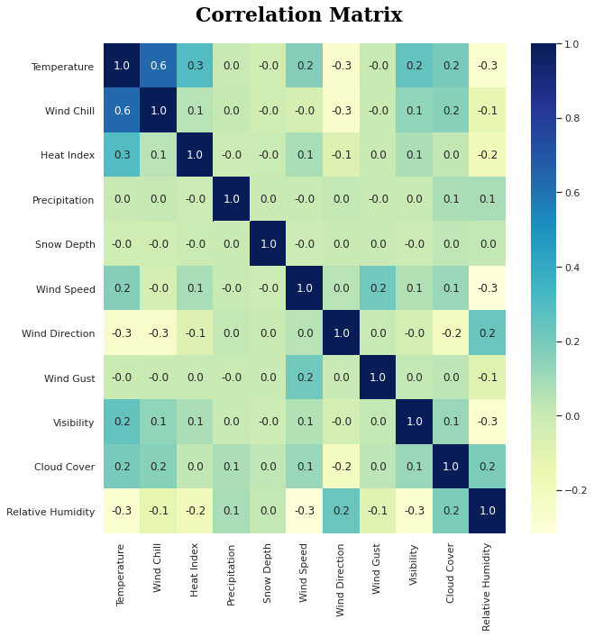

[Code on colab here](https://colab.research.google.com/drive/1v_zYDBG8ruGYCBb8JMfSFaYcVjg2_iLA?usp=sharing)

## Abstract

As society progresses, air quality is becoming an increasing concern in people's lives. We selected hourly recorded data from Lanzhou, China, between 13 May 2014 and 18 April 2020 as the training and test sets. The data itself was first explored by exploratory analysis and pre-processing, exploring the data itself through visualisation and other means and selecting appropriate feature values to put into the subsequent training. A random forest classification model was then built using pyspark and MLlib packages, and the model was trained and evaluated. After finding the optimal combination of parameters through parameter search, the model eventually made classification predictions for this dataset with an accuracy of 0.64. The experimental results show that the random forest classification model has good performance in predicting the air quality in Lanzhou city and has good application prospects.

## 1. Introduction

With the continuous improvement of people's production and living standards in today's society, environmental issues have gradually come into people's view<sup>\[1]</sup>. Lanzhou City, Gansu Province, is an ancient cultural city with a history of 2200 years. For a long time, as an essential industrial base and comprehensive transportation hub in the northwest, one of the critical central cities in the western region, and a vital node city of the Silk Road Economic Belt, Lanzhou has played an indispensable role in the political, economic and cultural development of the northwest<sup>\[2]</sup>. At the same time, as a city standing in the northwest, it also inevitably receives a certain amount of environmental impact<sup>\[3]</sup>. Nowadays, environmental problems are becoming more serious, especially in spring, when Lanzhou receives dust storms and other climatic causes<sup>\[4]</sup><sup>\[5]</sup>. In order to further reveal and manage the pollution situation of air quality in Lanzhou, it is necessary to understand the trend of air change, get timely, accurate and comprehensive air quality information, and make a precise prediction of air quality.

This project focuses on using hourly real-time weather data to predict air pollution levels. This problem is a classification problem, and we approached the task by classifying each hour using the models in pyspark's MLlib. We tested many model and chose RandomForestClassifier to meet the requirements of this problem<sup>\[6]</sup>. pyspark dataframe reads the dataset and fills in all missing values with means to ensure consistency of the data. Finally, we also used visualisation to explore which factors were more relevant to the classification of air quality levels and compared the performance of pyspark.ml with that of sklearn.

For this problem, we used two datasets: the hourly air quality data of Lanzhou, China, and the other is the hourly record of weather information of Lanzhou, China. These two datasets contain data from May 13, 2014, to April 18, 2020, which are 50043 hourly data records in total.

Through exploratory analysis of the data, we drew a distribution of classes, a distribution of features, a box plot of features and a heat map of correlations. By analysing these plots, we found correlations between each explanatory variable and class as well as some insignificant <sup>\[7]</sup>. We also pre-processed the data to convert them into a format suitable for model input.

## 2. Problem Definition

In this cloud computing project, our main problem is to predict the level of air quality at that moment based on current weather information such as temperature, humidity, wind speed etc. The problem is essentially a classification problem where we output real-time feature data for each hour, and then our machine learning model makes a judgement based on the feature values to assign that moment to a specific category. 

Since the characteristic values are generated in real-time and used for prediction, in order to solve the air quality classification and prediction, our model should have the characteristics of real-time, fast running, accurate results, high reliability, and high capacity for a large-scale operation, where the most serious difficulty is the running speed.

To sum up, the challanges we will face are:

* The data we use is the raw data without being processed. How should we do to make it suitable for our model?
* Data is generated and stored in real time, how should we deal with the storage and processing of large amounts of data.
* How can we improve the speed of training and prediction of models with time-sensitive results?
* Models require high accuracy of results, how should we try to improve the accuracy of our models?

And we choose to use pyspark and HDFS to deal with these challenges.

## 3. Data

For this problem, we used two datasets: the hourly air quality data of Lanzhou, China, and the other is the hourly record of weather information of Lanzhou, China. These two datasets contain data from May 13, 2014, to April 18, 2020, which are 50043 hourly data records in total.

The hourly air quality data is obtained from the National Urban Air Quality Real-time Release Platform of China's Environmental Monitoring Station, and the weather information came from Vitrul Crossing, a leading provider of weather data.

Air quality data set contains air quality data like AQI, pm2.5m pm10 and pm100 of each hour, and the weather data set contains weather information like the following :

* Temperature
* Maximum Temperature
* Minimum Temperature
* Wind Chill
* Snow
* Snow Depth
* Visibility
* Heat Index
* Precipitation
* Wind Speed
* Wind Direction
* Wind Gust
* Relative Humidity
* Conditions

However, there is no class attribute in these 2 data set, and we apply the classification of AQI for this task and discrete the AQI data into 6 class<sup>\[8]</sup>:

* excellent: 0-50
* good: 50-100
* lightly polluted: 100-150
* moderately polluted: 150-200
* heavily polluted: 200-300
* severely polluted: >300

## 4. Exploratory Data Analysis

### 4.1 Import related packages

```Python
import pyspark
from pyspark.sql import SparkSession
from pyspark import SparkContext 
from pyspark.sql import SQLContext
from pyspark.sql.functions import concat,lit
from pyspark.sql.functions import isnull,isnan, when, count, col
from pyspark.sql.functions import col, to_timestamp, date_format
from pyspark.sql.functions import row_number, monotonically_increasing_id
from pyspark.sql import Window
from pyspark.sql import functions as f 
from pyspark.sql.types import * 
import pandas as pd
import numpy as np
import seaborn as sns
import matplotlib.pyplot as plt

spark = SparkSession.builder.getOrCreate()
sns.set(style="whitegrid")
```

### 4.2 Air Quality data preprocess

#### 4.2.1 Load the data

Because the hourly data is stored in csv file for each day, we need to read and combine all the data file under the dictionary.

```Python
all_csv_path = 'hdfs://hadoop1:9000/user/hadoop/input/lanzhou/*.csv'
df_pollution =  spark.read.format('csv')\
    .option('header', 'true')\
    .option('inferSchema', 'true')\
    .load(all_csv_path)

df_pollution.limit(10).show()
```

#### 4.2.2 Format conversion of time and removal of useless columns

The time information here are consisted by columns 'date' and 'hour' here , we need to covert it to the 'yyyy/MM/dd HH:mm:ss' format for the following process. Also, we need to remove some useless columns in this task.

```Python
df_pollution.dtypes
```

```Python
df_pollution2 = df_pollution.withColumn("Time", concat(df_pollution['date'], lit(" "),df_pollution['hour'],lit(":00:00")))

df_pollution2 = df_pollution2.drop('date')
df_pollution2 = df_pollution2.drop('hour')
df_pollution2 = df_pollution2.withColumnRenamed('Time','Hour')
df_pollution2 = df_pollution2.withColumnRenamed('兰州','score')

df_pollution2 = df_pollution2.select('score', 'Hour').where((df_pollution2.type == 'AQI'))
df_pollution2.show()
```

#### 4.2.3 Fill missing value

Because the data is collected and stored automaticly in each hour, there will be some missing value for some reasons. To make the data suitable to feed the model, we have to fill the missing value. In this task, we use the mean value to fill the missing value.

```Python
df_pollution2.select([count(when(isnull(c), c)).alias(c) for c in df_pollution2.columns]).show()

mean = int(float((df_pollution2.describe().collect()[1][1])))
df_pollution2 = df_pollution2.na.fill({"score":mean})
df_pollution2.select([count(when(isnull(c), c)).alias(c) for c in df_pollution2.columns]).show()
```

#### 4.2.4 Convert 'Hour' column to timestamp type

For the following combination, we need to convert the 'Hour' column to timestamp since it is much easier to combine 2 dataframe on same timestemp, rather than string.

```Python
spark.sql("set spark.sql.legacy.timeParserPolicy=LEGACY")
df_pollution3 = df_pollution2.withColumn("Hour", to_timestamp(col("Hour"),"yyyyMMdd HH:mm:ss").alias("Hour1"))
df_pollution3.dtypes
```

### 4.3 Weather data process

#### 4.3.1 Load the data

```Python
df_weather =  spark.read.format('csv')\
    .option('header', 'true')\
    .option('inferSchema', 'true')\
    .load('hdfs://hadoop1:9000/user/hadoop/input/weather_data.csv')
```

#### 4.3.2 Fill missing value

```Python
df_weather1 = df_weather.na.fill(value=0)
df_weather1 = df_weather1.na.fill({"Snow":0,"Conditions":0})
```

#### 4.3.3 Remove useless columns

```Python
df_weather1 = df_weather1.drop('Name','Maximum Temperature','Minimum Temperature')
```

#### 4.3.4 Convert 'Date time' column to timestemp

```Python
spark.sql("set spark.sql.legacy.timeParserPolicy=LEGACY")
df_weather2 = df_weather1.withColumn("Hour", to_timestamp(col("Date time"),"MM/dd/yyyy HH:mm:ss").alias("Hour"))
df_weather2 = df_weather2.drop("Date time")
```

### 4.4 Combine 2 data sets

```Python
df_final = df_weather2.join(df_pollution3,on=["Hour"])
df_final.write.format("csv").option('header','true').save("./weather_aqi")
spark.stop()
```

### 4.5 Data Discretization

Firstly, the target weather_aqi.csv needs to be read into the pyspark environment using the SparkContext function and the SQLContext function. In order to index the rows more conveniently, we need to create the index in the dataframe, so the monotonically_increasing_id function should be used to obtain the ordered index.

The next step is to utilize the discretization of continuous attributes. Since our project focuses on the classification task using the random forest model, discretization ensures that the task is about classification instead of regression. The fillArray function contains the rule of discretizing the score column. We divide all the continuous value of AQI into six levels, with each level has a different bounded value.

The udf() function creates a function in a Python syntax and wraps it with PySpark SQL udf()<sup>\[9]</sup>. Therefore, we can use the custom function on the dataframe or the column of dataframe.

The withColumn() is a transformation function of DataFrame, which is used to change the value, convert the datatype of an existing column, or create a new column. The initial column score is transformed with the custom function fillArray, and then the withColumn() function creates a new column named df_dis in the dataframe.

### 4.6 Visualization

#### 4.6.1 Transfering the data to pandas dataframe

To make visualization look better, we decide to use pandas dataframe to store data instead of pyspark dataframe.

```Python
df = df_dis.toPandas()
```

#### 4.6.2 Draw the bar chart of classes

```Python
fig = plt.figure(figsize=(18,12))
ax = fig.add_subplot(1, 1, 1, frameon=True)
sns.countplot(data=df,x='AQI_dis')
ax.set_xticklabels(['excellent', 'good','lightly polluted', 'moderately polluted', 'heavily polluted', 'severely polluted'])
fig.show()
```



To make the classification process more simple, we use 6 different integers to represent 6 different classes of air quality levels.

From this chart, we can find that in the most time, the air quality is good, and only a few hours that Lanzhou had a serious air pollution.

#### 4.6.3 Draw the distributions of features

```Python
fig = plt.figure(figsize=(24,12))
gs = fig.add_gridspec(3,4)
gs.update(wspace=0.5, hspace=0.5)
ax0 = fig.add_subplot(gs[0,0])
ax1 = fig.add_subplot(gs[0,1])
ax2 = fig.add_subplot(gs[0,2])
ax3 = fig.add_subplot(gs[0,3])
ax4 = fig.add_subplot(gs[1,0])
ax5 = fig.add_subplot(gs[1,1])
ax6 = fig.add_subplot(gs[1,2])
ax7 = fig.add_subplot(gs[1,3])
ax8 = fig.add_subplot(gs[2,0])
ax9 = fig.add_subplot(gs[2,1])
ax10 = fig.add_subplot(gs[2,2])
ax11 = fig.add_subplot(gs[2,3])

ax0.set_xticklabels([])
ax0.set_yticklabels([])
ax0.grid(False) 
ax0.text(0.5,0.5,
         'The kernel density\nestimation plots',
         horizontalalignment='center',
         verticalalignment='center',
         fontsize=24, fontweight='bold',
         fontfamily='serif',
         color="#000000")
ax0.spines["bottom"].set_visible(False)
ax0.spines["left"].set_visible(False)
ax0.spines["top"].set_visible(False)
ax0.spines["right"].set_visible(False)
ax0.tick_params(left=False, bottom=False)

ax1.grid(color='#000000', linestyle=':', axis='y', zorder=0,  dashes=(1,5))
sns.kdeplot(ax=ax1, data=df, x='Wind Chill',hue="AQI_dis", fill=True,  alpha=.5, linewidth=0)

ax2.grid(color='#000000', linestyle=':', axis='y', zorder=0,  dashes=(1,5))
sns.kdeplot(ax=ax2, data=df, x='Heat Index',hue="AQI_dis", fill=True,  alpha=.5, linewidth=0)

ax3.grid(color='#000000', linestyle=':', axis='y', zorder=0,  dashes=(1,5))
sns.kdeplot(ax=ax3, data=df, x='Precipitation',hue="AQI_dis", fill=True,  alpha=.5, linewidth=0)

ax4.grid(color='#000000', linestyle=':', axis='y', zorder=0,  dashes=(1,5))
sns.kdeplot(ax=ax4, data=df, x='Snow Depth',hue="AQI_dis", fill=True, alpha=.5, linewidth=0)

ax5.grid(color='#000000', linestyle=':', axis='y', zorder=0,  dashes=(1,5))
sns.kdeplot(ax=ax5, data=df, x='Wind Speed',hue="AQI_dis", fill=True, alpha=.5, linewidth=0)

ax6.grid(color='#000000', linestyle=':', axis='y', zorder=0,  dashes=(1,5))
sns.kdeplot(ax=ax6, data=df, x='Wind Direction',hue="AQI_dis", fill=True,  alpha=.5, linewidth=0)

ax7.grid(color='#000000', linestyle=':', axis='y', zorder=0,  dashes=(1,5))
sns.kdeplot(ax=ax7, data=df, x='Wind Gust',hue="AQI_dis", fill=True,  alpha=.5, linewidth=0)

ax8.grid(color='#000000', linestyle=':', axis='y', zorder=0,  dashes=(1,5))
sns.kdeplot(ax=ax8, data=df, x='Visibility',hue="AQI_dis", fill=True,  alpha=.5, linewidth=0)

ax9.grid(color='#000000', linestyle=':', axis='y', zorder=0,  dashes=(1,5))
sns.kdeplot(ax=ax9, data=df, x='Cloud Cover',hue="AQI_dis", fill=True,  alpha=.5, linewidth=0)

ax10.grid(color='#000000', linestyle=':', axis='y', zorder=0,  dashes=(1,5))
sns.kdeplot(ax=ax10, data=df, x='Relative Humidity',hue="AQI_dis", fill=True,  alpha=.5, linewidth=0)

ax11.grid(color='#000000', linestyle=':', axis='y', zorder=0,  dashes=(1,5))
sns.kdeplot(ax=ax11, data=df, x='Temperature',hue="AQI_dis", fill=True,  alpha=.5, linewidth=0)
plt.show()
```



The analysis of the kernel density estimation plots reveals the distribution of the different feature data between the different categories, reflecting how much the features contribute to the classification<sup>\[10]</sup>. This dataset shows that the data distribution of Heat index, Precipitation, Wind Gust, and Snow Depth is concentrated around 0 in all six categories, with low differentiation. Direction has the highest variability in their distributions, so we infer that they contribute more to the classification.

#### 4.6.4 Draw box plots

Since we find some difference between classes, we will use box plots to help us find more insights from data.

````Python
fig = plt.figure(figsize=(24,12))
gs = fig.add_gridspec(3,4)
gs.update(wspace=0.5, hspace=0.5)
ax0 = fig.add_subplot(gs[0,0])
ax1 = fig.add_subplot(gs[0,1])
ax2 = fig.add_subplot(gs[0,2])
ax3 = fig.add_subplot(gs[0,3])
ax4 = fig.add_subplot(gs[1,0])
ax5 = fig.add_subplot(gs[1,1])
ax6 = fig.add_subplot(gs[1,2])
ax7 = fig.add_subplot(gs[1,3])
ax8 = fig.add_subplot(gs[2,0])
ax9 = fig.add_subplot(gs[2,1])
ax10 = fig.add_subplot(gs[2,2])
ax11 = fig.add_subplot(gs[2,3])

ax0.set_xticklabels([])
ax0.set_yticklabels([])
ax0.grid(False) 
ax0.text(0.5,0.5,
         'The Boxen plots',
         horizontalalignment='center',
         verticalalignment='center',
         fontsize=24, fontweight='bold',
         fontfamily='serif',
         color="#000000")
ax0.spines["bottom"].set_visible(False)
ax0.spines["left"].set_visible(False)
ax0.spines["top"].set_visible(False)
ax0.spines["right"].set_visible(False)
ax0.tick_params(left=False, bottom=False)

ax1.grid(color='#000000', linestyle=':', axis='y', zorder=0,  dashes=(1,5))
sns.boxenplot(ax=ax1, data=df, y='Wind Chill',x="AQI_dis")

ax2.grid(color='#000000', linestyle=':', axis='y', zorder=0,  dashes=(1,5))
sns.boxenplot(ax=ax2, data=df, y='Heat Index',x="AQI_dis")

ax3.grid(color='#000000', linestyle=':', axis='y', zorder=0,  dashes=(1,5))
sns.boxenplot(ax=ax3, data=df, y='Precipitation',x="AQI_dis")

ax4.grid(color='#000000', linestyle=':', axis='y', zorder=0,  dashes=(1,5))
sns.boxenplot(ax=ax4, data=df, y='Snow Depth',x="AQI_dis")

ax5.grid(color='#000000', linestyle=':', axis='y', zorder=0,  dashes=(1,5))
sns.boxenplot(ax=ax5, data=df, y='Wind Speed',x="AQI_dis")

ax6.grid(color='#000000', linestyle=':', axis='y', zorder=0,  dashes=(1,5))
sns.boxenplot(ax=ax6, data=df, y='Wind Direction',x="AQI_dis")

ax7.grid(color='#000000', linestyle=':', axis='y', zorder=0,  dashes=(1,5))
sns.boxenplot(ax=ax7, data=df, y='Wind Gust',x="AQI_dis")

ax8.grid(color='#000000', linestyle=':', axis='y', zorder=0,  dashes=(1,5))
sns.boxenplot(ax=ax8, data=df, y='Visibility',x="AQI_dis")

ax9.grid(color='#000000', linestyle=':', axis='y', zorder=0,  dashes=(1,5))
sns.boxenplot(ax=ax9, data=df, y='Cloud Cover',x="AQI_dis")

ax10.grid(color='#000000', linestyle=':', axis='y', zorder=0,  dashes=(1,5))
sns.boxenplot(ax=ax10, data=df, y='Relative Humidity',x="AQI_dis")

ax11.grid(color='#000000', linestyle=':', axis='y', zorder=0,  dashes=(1,5))
sns.boxenplot(ax=ax11, data=df, y='Temperature',x="AQI_dis")
plt.show()```
````



From the distribution of data in 6 different classes, we can conclude the following insights:

* The Wind Chill have a similar distribution among different classes.
* The distribution of the Heat index is very similar in classes 0, 1 and 2, and very similar in 3, 4 and 5, but there is a large difference between the two groups.
* The distribution of precipitation gradually converges with decreasing air quality.
* The non-zero values for Snow Depth are predominantly in the better air moments.
* The distribution of Wind Speed varies very little between categories
* The distribution of Wind Direction is relatively even, with only some differences in the central values and quartiles
* Wind Gust is relatively evenly distributed, with only some differences in outliers and quartiles
* Visibility distribution converges and decreases with decreasing air quality
* Cloud Cover has a larger overall distribution for class 0, similar distribution for class 1 and class 5, similar distribution for class 3 and class 4, and smaller overall values for class 2.
* Relative humidity gradually converges and decreases with decreasing air quality except for class 5, but becomes greater at class 5
* The median temperature gradually approaches 0 degrees Celsius as the air quality decreases, and the overall temperature distribution gradually converges as the

Therefore, we can see that in this dataset, wind speed, wind direction, and wind gust have a small degree of differentiation across air quality, and therefore we believe that the contribution of these data to the classification results will be small.

#### 4.6.4 Draw correlation matrix

```Python
features = ['Temperature', 'Wind Chill', 'Heat Index', 'Precipitation',
       'Snow Depth', 'Wind Speed', 'Wind Direction', 'Wind Gust',
       'Visibility', 'Cloud Cover', 'Relative Humidity']
fig = plt.figure(figsize=(10,10))
gs = fig.add_gridspec(1,1)
gs.update(wspace=0.3, hspace=0.15)
ax0 = fig.add_subplot(gs[0,0])

color_palette = ["#5833ff","#da8829"]
ax0.text(2.5,-0.5,"Correlation Matrix",fontsize=22, fontweight='bold', fontfamily='serif', color="#000000")
df_corr = df[features].corr().transpose()
sns.heatmap(df_corr,mask=None,fmt=".1f",annot=True,cmap='YlGnBu')
plt.show()
```



By drawing the correlation matrix, we can initially determine whether there is multicollinearity between the characteristic variables, i.e. where the model estimates are distorted or difficult to estimate accurately due to the presence of exact correlations or high correlations between the explanatory variables<sup>[11]</sup>. Multicollinearity can also arise from the repetition of the same kinds of variables or the inclusion of a variable which is computed from other variables in the data set<sup>[12]</sup>.

The correlation matrix shows that the correlation between Wind Chill and Temperature is relatively low, except for the correlation between Wind Chill and Temperature which is as high as 0.6. The correlation between Wind Chill and Temperature is due to the fact that the formula for Wind Chill is $
H=(12.12+11.6 \sqrt{v}-1.16 v)\left(T-t_{\alpha}\right)
$ and $t_{\alpha}$ is the Temperature. Therefore, we can assume that there is multicollinearity between Wind Chill and Temperature, while there is no multicollinearity between the other explanatory variables.

Here, our multicollinearity exists only between the two variables and the correlation is low enough not to have a significant impact on the results<sup>[13]</sup>. We therefore decided to retain the two explanatory variables Wind Chill and Temperature as features to train our classifier.

## 5. Modeling and Evaluation
### 5.1 Import related packages
```Python
# Feature Selection
from pyspark.ml.feature import StandardScaler
from pyspark.ml.feature import VectorAssembler
# build three models
from pyspark.ml.classification import RandomForestClassifier
from pyspark.ml.classification import DecisionTreeClassifier
from pyspark.ml.classification import LogisticRegression
from pyspark.ml.evaluation import MulticlassClassificationEvaluator
from pyspark.mllib.evaluation import MulticlassMetrics
import pyspark.ml.classification as cl
import pyspark.ml.evaluation as ev
import pyspark.ml.tuning as tune
```

### 5.2 Feature Selection
In the feature selection process, 10 attributes are selected as features, they are 'Temperature', 'Wind Chill', 'Heat Index', 'Precipitation', 'Snow Depth', 'Wind Speed', 'Wind Gust', 'Wind Direction', 'Visibility', 'Relative Humidity'. The attribute 'Snow' does not be chosen as feature, since the 'Snow' has nearly the same meaning of the 'Snow Depth'. The attribute 'Snow' means that if this city has the snowy day or not in a particular time, and the 'Snow Depth' means that the extent of snowy day in a particular time, therefore, the 'Snow Depth' not only contains the 'Snow', but also is more meaningful and useful than the 'Snow'. Based on these analyses, we decided to choose 'Snow Depth' as one of the features instead of using 'Snow'

#### 5.2.1 VectorAssembler 
The VectorAssembler function are used to merge multiple feature columns as one vector column. This new generated vector will be added into the dataframe as a new column ”features”.Then, the transform method in the VectorAssembler is to transform the dataframe into a dense vector, which can be fitted into the building stage of feature importance.  
```Python
features =   ['Temperature','Wind Chill','Heat Index','Precipitation','Snow Depth','Wind Speed','Wind Gust','Wind Direction','Visibility','Relative Humidity']
assembler = VectorAssembler(inputCols=features,outputCol="features")
raw_data=assembler.transform(df_dis)
raw_data.select("features").show(truncate=False)
```

#### 5.2.2 StandardScaler 
The StandardScaler function is to normalize the dense vector from the result of VectorAssembler function, transforming the dense vector into a more reasonable and meaningful value. The result of StandardScaler will be a new column named "Scaled_features" in the dataframe, and this column will be used in the analysis of feature importance.
```Python
standardscaler=StandardScaler().setInputCol("features").setOutputCol("Scaled_features")
raw_data=standardscaler.fit(raw_data).transform(raw_data)
raw_data.select("features","Scaled_features").show(5)
raw_data.show()
```

### 5.3 Split the data
We use the filter function to split the train set and test set manually, and then store the train and test set into the csv file. Thus, these files can be read directly as the pandas dataframe by using the read_csv function in pandas, which makes preparation for comparing the models’ performance on the pandas utilization and the pyspark utilization. Through the train.count() and test. count () function, we can get the size of training dataset and testing dataset.

```Python
train = raw_data.filter("index < 35000")
test = raw_data.filter("index >= 35000")
```

### 5.4 Modeling
#### 5.4.1 Random Forest
The random forest model is built by calling the RandomForestClassifier through clarify featuresCol as “Scaled_features” and labelCol as “AQI_dis”, and also define some hyper-parameters. Then, the transform function will be applied on the test dataset to obtain a new dataframe with prediction and prediction_probability, which the prediction column shows the predicted type of AQI and the prediction_probability column shows the probability of predicted type.
```Python
rfModel = RandomForestClassifier(featuresCol='Scaled_features',labelCol='AQI_dis',maxDepth=10,numTrees=30).fit(train)
# make the prediction
testRslt = rfModel.transform(test)
testRslt.limit(10).show()
```

The MulticlassClassificationEvaluator function from the pyspark.ml.evaluation package will be used for obtaining the evaluation results of the model. By changing the value of hyper-parameter “metricName, different metrics will be used in evaluating the model performance, such as f1, accuracy, precision and recall.
```Python
evaluator = MulticlassClassificationEvaluator(labelCol='AQI_dis',predictionCol="prediction", metricName="accuracy")
accuracy_rf = evaluator.evaluate(testRslt)
print(accuracy_rf)
```

```Python
evaluator = MulticlassClassificationEvaluator(labelCol='AQI_dis',predictionCol="prediction", metricName="f1")
f1_rf = evaluator.evaluate(testRslt)
print(f1_rf)
```

```Python
evaluator = MulticlassClassificationEvaluator(labelCol='AQI_dis',predictionCol="prediction", metricName="weightedPrecision")
Precision_rf = evaluator.evaluate(testRslt)
print(Precision_rf)
```

```Python
evaluator = MulticlassClassificationEvaluator(labelCol='AQI_dis',predictionCol="prediction", metricName="weightedRecall")
Recall_rf = evaluator.evaluate(testRslt)
print(Recall_rf)
testRslt.select(['prediction', 'AQI_dis']).show(10)
```

#### 5.4.2 Decision tree
The Decision tree model is built by calling the RandomForestClassifier through clarify featuresCol as “Scaled_features” and labelCol as “AQI_dis”, and also define some hyper-parameters. Then, the transform function will be applied on the test dataset to obtain a new dataframe with prediction and prediction_probability, which the prediction column shows the predicted type of AQI and the prediction_probability column shows the probability of predicted type.

```Python
decisiontree = DecisionTreeClassifier(labelCol="AQI_dis", featuresCol="Scaled_features", 
                              impurity='gini', maxDepth=10, minInstancesPerNode = 200)
model = decisiontree.fit(train)
predictions_dt = model.transform(test)
predictions_dt.select(['prediction', 'AQI_dis']).show(10)
```

Different metrics(f1, accuracy, precision and recall) will also be used in evaluating the performance of the decision tree model.

```Python
evaluator = MulticlassClassificationEvaluator(labelCol='AQI_dis',predictionCol="prediction", metricName="accuracy")
accuracy_dt = evaluator.evaluate(predictions_dt)
print(accuracy_dt)
```

```Python
evaluator = MulticlassClassificationEvaluator(labelCol='AQI_dis',predictionCol="prediction", metricName="f1")
f1_dt = evaluator.evaluate(predictions_dt)
print(f1_dt)
```

```Python
evaluator = MulticlassClassificationEvaluator(labelCol='AQI_dis',predictionCol="prediction", metricName="weightedPrecision")
Precision_dt = evaluator.evaluate(predictions_dt)
print(Precision_dt)
```

```Python
evaluator = MulticlassClassificationEvaluator(labelCol='AQI_dis',predictionCol="prediction", metricName="weightedRecall")
Recall_dt = evaluator.evaluate(predictions_dt)
print(Recall_dt)
```

#### 5.4.3 Logistic Regression
The Logistic Regression model is built by calling the RandomForestClassifier through clarify featuresCol as “Scaled_features” and labelCol as “AQI_dis”, and also define some hyper-parameters. Then, the transform function will be applied on the test dataset to obtain a new dataframe with prediction and prediction_probability, which the prediction column shows the predicted type of AQI and the prediction_probability column shows the probability of predicted type.
```Python
LR=LogisticRegression(featuresCol='Scaled_features',labelCol='AQI_dis')
LRmodel=LR.fit(train)
resultLR=LRmodel.transform(test)
```

Different metrics(f1, accuracy, precision and recall) will also be used in evaluating the performance of the logistic regression model.

```Python
evaluator = MulticlassClassificationEvaluator(labelCol='AQI_dis',predictionCol="prediction", metricName="accuracy")
accuracy_dt = evaluator.evaluate(predictions_dt)
print(accuracy_dt)
```

```Python
evaluator = MulticlassClassificationEvaluator(labelCol='AQI_dis',predictionCol="prediction", metricName="f1")
f1_dt = evaluator.evaluate(predictions_dt)
print(f1_dt)
```

```Python
evaluator = MulticlassClassificationEvaluator(labelCol='AQI_dis',predictionCol="prediction", metricName="weightedPrecision")
Precision_dt = evaluator.evaluate(predictions_dt)
print(Precision_dt)
```

```Python
evaluator = MulticlassClassificationEvaluator(labelCol='AQI_dis',predictionCol="prediction", metricName="weightedRecall")
Recall_dt = evaluator.evaluate(predictions_dt)
print(Recall_dt)
```

### 5.5 Cross Validation
#### 5.5.1 Create the CrossValidator

The first step for cross validation is to create the CrossValidator, which has three main components: estimator, grid and evaluator.
The estimator is our target model for applying the cross validation function. The grid is the target hyper-parameters set for finding the best hyper-parameter combinations. The evaluator is the MulticlassClassificationEvaluator that we have already used in the modeling stage. Then, the CrossValidator also defines the number of fold that is used in the process of cross validation. We use 5-fold in our project.

```Python
RFclassifier = cl.RandomForestClassifier(labelCol='AQI_dis')
grid = tune.ParamGridBuilder()\
    .addGrid(RFclassifier.maxDepth, [8, 10, 12]) \
    .addGrid(RFclassifier.numTrees, [20, 25, 30])\
    .build()
evaluator = ev.MulticlassClassificationEvaluator(predictionCol='prediction', labelCol='AQI_dis',metricName="accuracy",probabilityCol="probability")

cv = tune.CrossValidator(
    estimator=RFclassifier, 
    estimatorParamMaps=grid, 
    evaluator=evaluator,
    numFolds=5
)
```

#### 5.5.2 Run the Cross validation on random forest model
After building the model and transforming to get the prediction, the best hyper-parameter combination is the output.

```Python
cvModel = cv.fit(train)
prediction = cvModel.transform(test)
parameters = [
    (
        [
            {key.name: paramValue} 
            for key, paramValue 
            in zip(
                params.keys(), 
                params.values())
        ], metric
    ) 
    for params, metric 
    in zip(
        cvModel.getEstimatorParamMaps(), 
        cvModel.avgMetrics
    )
]
print(sorted(parameters, key=lambda el: el[1], reverse=True)[0])
```

### 5.6 Evaluation
#### 5.6.1 Import related packages

```Python
# feature importance
from sklearn.model_selection import train_test_split
import matplotlib as plt
import numpy as np
from sklearn.preprocessing import StandardScaler
from sklearn.ensemble import RandomForestClassifier as RF
import matplotlib.pyplot as plt
# confusion matrix
from sklearn.model_selection import KFold
from sklearn.tree import DecisionTreeClassifier 
from sklearn.linear_model import LogisticRegression
from sklearn.metrics import confusion_matrix
```

#### 5.6.2 Feature Importance
Before exploring the feature importance in the random forest model, the format of data needs to be transformed, and the feature column also needs to be defined and transformed into single vector. The train_test_split step is building the foundation for the modeling of random forest.

```Python
raw_data_pandas = raw_data.toPandas()
raw_data_pandas.set_index("index")
y = raw_data_pandas['AQI_dis']
y = np.array(y)
X = raw_data_pandas.loc[:,['Temperature','Wind Chill','Heat Index','Precipitation','Snow Depth','Wind Speed','Wind Gust','Wind Direction','Visibility','Relative Humidity']]
scaler = StandardScaler()
X = scaler.fit_transform(X)

features_col = ['Temperature','Wind Chill','Heat Index','Precipitation','Snow Depth','Wind Speed','Wind Gust','Wind Direction','Visibility','Relative Humidity']
features = raw_data_pandas.loc[:,features_col]
scaler = StandardScaler()
features = scaler.fit_transform(features)
train_index,test_index = train_test_split(raw_data_pandas.index)
```

Building the random forest model based on the training set is the first step, and then, we obtain the feature importance by using the build-in function feature_importances.

```Python
forest = RF()
forest_fit = forest.fit(X[train_index], y[train_index])
forest_predictions = forest_fit.predict(X[test_index])

importances = forest_fit.feature_importances_[:7]
std = np.std([tree.feature_importances_ for tree in forest.estimators_],
             axis=0)
indices = np.argsort(importances)[::-1]

print("Feature ranking:")
for f in range(7):
    print("%d. %s (%f)" % (f, features_col[f], importances[indices[f]]))


plt.figure()
plt.title("Feature importances")
plt.bar(range(7), importances[indices], yerr=std[indices], color="r", align="center")
plt.xticks(range(7), features_col,rotation=30)
plt.xlim([-1, 7])
plt.show()
```
Analyzing the graph and text in the output, it is easy to find the top three features are more importance than other features. The values of top 3 features are larger than 0.01, the differences between features can also be told from the bar chart.

#### 5.6.3 Plot the Confusion Matrix
Firstly, two custom functions are defined and constructed, which are run_cv and draw_confusion_matrices. The run_cv function is to obtain the prediction result of the given test set. And then, the predictions will perform as the parameter of the confusion_matrix function. The draw_confusion_matrices function is to visualize the confusion matrix in the multiclassification task.

```Python
def run_cv(X,y,clf_class,**kwargs):
    kf = KFold(n_splits=5)
    y_pred = y.copy()

    for train_index, test_index in kf.split(X):
        X_train, X_test = X[train_index], X[test_index]
        y_train = y[train_index]

        clf = clf_class(**kwargs)
        clf.fit(X_train,y_train)
        y_pred[test_index] = clf.predict(X_test)
    return y_pred

def draw_confusion_matrices(confusion_matricies,class_names):
    class_names = class_names.tolist()
    for cm in confusion_matrices:
        classifier, cm = cm[0], cm[1]
        print(cm)
        
        fig = plt.figure()
        ax = fig.add_subplot(111)
        cax = ax.matshow(cm)
        plt.title('Confusion matrix for %s' % classifier)
        fig.colorbar(cax)
        ax.set_xticklabels([''] + class_names)
        ax.set_yticklabels([''] + class_names)
        plt.xlabel('Predicted')
        plt.ylabel('True')
        plt.show()
```

Using the predefined function and the built-in function confusion_matrix, we can visualize the confusion matrix for three different classification models:DecisionTree,LogisticRegression and RandomForest.

```Python
class_names = np.unique(y)
confusion_matrices = [
    ( "Decision Tree", confusion_matrix(y,run_cv(X,y,DecisionTreeClassifier))) ,
    ( "Random Forest", confusion_matrix(y,run_cv(X,y,RF))),
    ( "Logistic Regression", confusion_matrix(y,run_cv(X,y,LogisticRegression))) 
    
]

%matplotlib inline

draw_confusion_matrices(confusion_matrices,class_names) 
```

From the graph of confusion matrix, we can get the conclusion that most instances belongs to the class 1 of AQI. A large number of instances belongs to the class 2 of AQI, however, the model predicts that they belongs to the class 1 of AQI, resulting into the unsatisfied value of accuracy and other metrics.

## 6. Discussion and Conclusion

In the feature importance stage, according to the result, the most important features is Temperature. If it is possible to continue, we can conduct a better or personalized preprocess work for Temperature, and the performance of the random forest model may be better.

Through the  analysis of confusion matrix visualization, a large number of misclassified instances are predicted as the class 1 of AQI, but they actually belongs to the class 2 of AQI. This phenomenon may reveals why the performance of model is not satisfied. In future, if we can make the boundary value between class 1 and class 2 more clear by using some methods, the model will have a larger chance to classify those instances correctly. Hence, the performance of model will be improved.

In the future, we will also begin to consider the influence of historical air quality data, time information, and weather information on air quality prediction, using LSTM models to improve them, achieve short-term multiple predictions and attempt to improve accuracy<sup>[14]</sup>.

Finally, in this project we learnt how to complete a complete project in both ml and spark environments and became familiar with the use of pyspark and the different modelling methods and processes. Although this consumed a lot of time and effort, it was worth it.

## 7. References

[1] Li M, Zhang L. Haze in China: Current and Future Challenges[J]. Environmental Pollution, 2014, 189 ( Complete ) : 85-86.<br/>
[2]	Wang L. A Preliminary Study on the Evolution of Urban Functions in Lanzhou City[J]. Lanzhou Academic Journal, 1995(01):50-52.<br/>
[3]	Chu, P. C., Chen, Y., Lu, S., Li, Z., & Lu, Y. (2008). Particulate air pollution in Lanzhou China. Environment International, 34(5), 698-713.<br/>
[4]	Chen, L. H., Yu, Y., Chen, J. B., Li, W. Y., & Li, J. L. (2010). Characteristics of Main Air Pollution in Lanzhou During 2001--2007. Plateau Meteorology, 29(6), 1627-1633.<br/>
[5]	Yu, Y., Xia, D. S., Chen, L. H., Liu, N., Chen, J. B., & Gao, Y. H. (2010). Analysis of particulate pollution characteristics and its causes in Lanzhou, Northwest China. Huan jing ke xue= Huanjing kexue, 31(1), 22-28.<br/>
[6] Singh, Pramod, and Singh. Machine Learning with PySpark. Apress, 2004.<br/>
[7] Mansfield, Edward R., and Billy P. Helms. "Detecting multicollinearity." The American Statistician 36.3a (1982): 158-160.<br/>
[8] Wang, Kunlun, Hongchun Yin, and Yiwen Chen. "The effect of environmental regulation on air quality: A study of new ambient air quality standards in China." Journal of Cleaner Production 215 (2019): 268-279.<br/>
[9] Drabas, Tomasz, and Denny Lee. Learning PySpark. Packt Publishing Ltd, 2017.<br/>
[10] Terrell, George R., and David W. Scott. "Variable kernel density estimation." The Annals of Statistics (1992): 1236-1265.<br/>
[11] Alin, Aylin. "Multicollinearity." Wiley Interdisciplinary Reviews: Computational Statistics 2.3 (2010): 370-374.<br/>
[12] Franke, George R. "Multicollinearity." Wiley international encyclopedia of marketing (2010).<br/>
[13] Schroeder, Mary Ann, Janice Lander, and Stacey Levine-Silverman. "Diagnosing and dealing with multicollinearity." Western journal of nursing research 12.2 (1990): 175-187.<br/>
[14] Hable-Khandekar, V., & Srinath, P. (2017, August). Machine Learning Techniques for Air Quality Forecasting and Study on Real-Time Air Quality Monitoring. In 2017 International Conference on Computing, Communication, Control and Automation (ICCUBEA) (pp. 1-6). IEEE.


